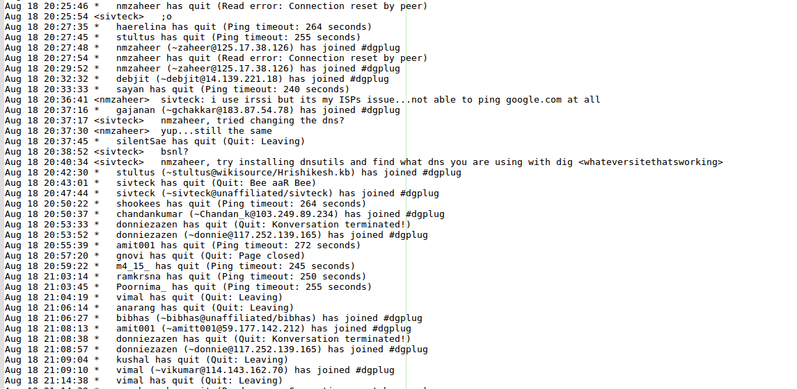

# Simpler IRC logs

**as tried on Xchat(2.8.8) IRC client**

This is a very simple python3 script that takes in a raw IRC log filename as an argument and outputs a less cluttered text output of the logs

The IRC log stores all the system notifications of people joining in the channel and leaving the channel which makes it very messy and hard to read the actual content. So as a way to make my life a bit easier I wrote this.

Sample:

It doesn't do much. Basically all it does is take in the IRC log file and remove all the lines containing '\*'. Which you might think is very risky but works almost 99% of the time :D ~~at least on Xchat LOL~~
